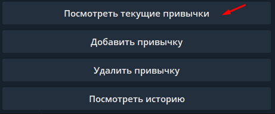
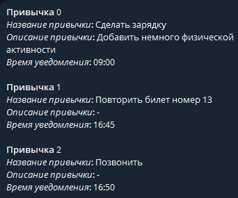
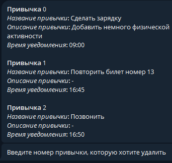
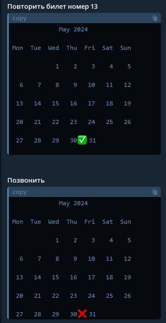

.. _usage_guide:

usage_guide
============

Начните диалог командой /start (если не запустился автоматически)

Меню бота выглядит следующим образом (для русской и английской версий)

.. image:: _static/menu.png 
.. image:: _static/en.png

Чтобы добавить привычку нажмите на кнопку: **"Добавить привычку"**

.. image:: _static/add_habit.png

Далее следуйте инструкциям:

- введите название привычки
- введите описание привычки

Чтобы посмотреть список активных привычек выберите пункт 
**"Посмотреть текущие привычки"**

Окно с текущими активными привычками будет выглядеть так:

В назначенное время привычки (немного ранее) Вам придет оповещение о ней. 
Вы можете указать, выполнено действие привычки или нет.

.. image:: _static/approve_action.png

Также можно удалить определенную привычку. Для этого выберите соответствующий пункт в меню бота.
И введите номер привычки, который необходимо удалить.

Вы можете посмотреть историю привычек, выбрав пункт **"Посмотреть историю"**

